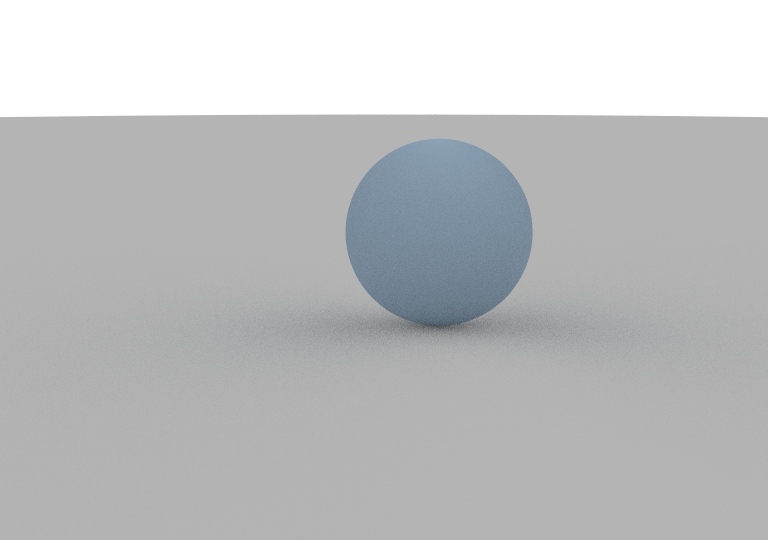
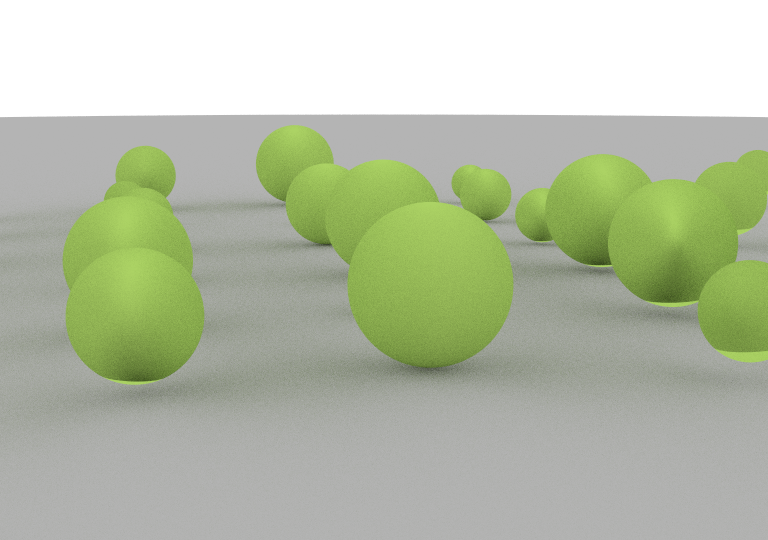
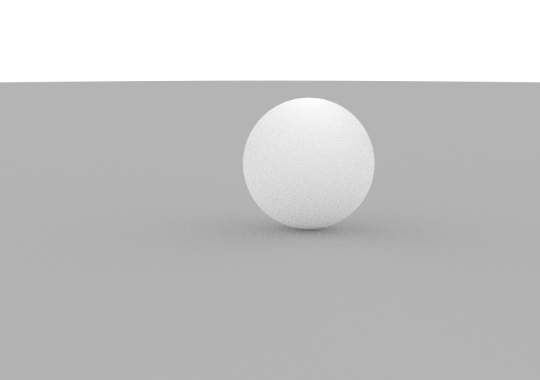
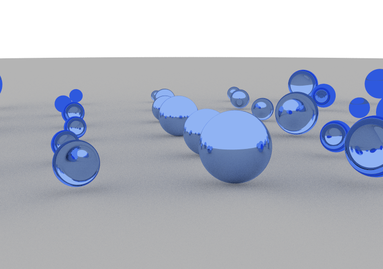
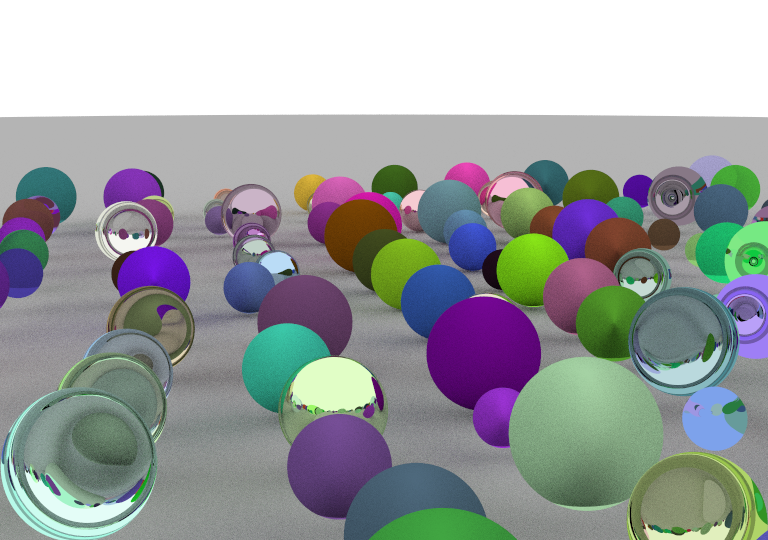

# Path-Trace-Image-Generator

C++-based path-tracing algorithm for producing standard resolution images.
- CPU only for highest accuracy
- Multi-threaded due to large amount of computations.

Five images are generated for Diffusion and Specular lighting.

## Diffuse Tests:

## Specular Tests:

## Diffuse and Specular Test:

  

